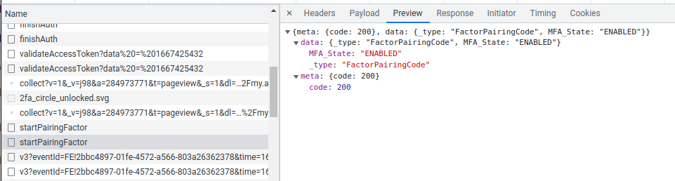

# hass-aarlo

---


## Version 0.7??
**This is the _README_ for 0.8.1, if you are using version 0.7; see
[here](https://github.com/twrecked/hass-aarlo/blob/version-0.7.x/README.md)
for the correct _README_**


## New Features in 0.8.1

### Config Flow

Finally. Thanks to @NickM-27 for starting this. After sitting on it for far too
long I decided to do the work I needed to, this integration now acts much like 
every intergration, splitting down by entity, device and integration.

This means a lot of this documentation is now out of date, I will upgrade it
when all the option changes have been finalised, for now I will just add a
quick note inline. 

#### What pieces are done

- _upgrade_; the code will upgrade a _0.7_ build to the _config flow_ system.
  Your current configuration will be moved into 2 places. The username, 
  password and 2FA setting will be moved into the code config regisrty, all
  other config will be moved into a _aarlo.yaml_ file. For all other setting
  they have been moved into the _Integration_ configure dialogs.
- _device groupings_; for example, a camera battery will appear as
  an entity under a camera device.

#### What pieces need doing

- _integration creation_; you can create new integrations but you will need 
  to reconfigure them to get all the sensors working
- _reload/reconfigure_; works, but I need to deal with orphans when devices 
  are turned off
- _unique ids_; create better one for new integrations
- _config_; maybe work out which config pieces are really needed

#### What if it goes wrong?

For now I recommend leaving your old configuration in place so you can revert
back to a _0.7_ release if you encounter an issue.


## New Features in 0.8.0

### Split Out Pyaarlo
The code now uses _Pyaarlo_ by installing it via _pip_ rather than maintaining
its own version. If you run into a problem check the [Pyaarlo
README](https://github.com/twrecked/pyaarlo/blob/master/README.md) file,it may
have a fix not mentioned here.

### Authentication Caching
The code will retry authorization tokens for as long as they are valid. This
means a reduction in authentication attempts and 2FA requests. If this does
not work for you send me some logs showing the error and restart with
`save_session: False` added to your configuration.

### Saner Defaults
You will now have less to configure... for example, device refresh and stream
timeouts are enabled by default.

## Breaking Changes in 0.8
The following options have been removed:
- `hide_deprecated_services`; all component services are now in the `aarlo`
  domain.
- `http_connections`; no longer used after _cloudscraper_ was needed
- `http_max_size`; no longer used after _cloudscraper_ was needed


## Table of Contents
- [Introduction](#introduction)
- [Installation](#installation)
- [Configuration](#configuration)
   - [Moving from Arlo](#configuration-moving)
   - [Creating a Login](#configuration-login)
   - [Main Configuration](#configuration-main)
   - [Alarm Configuration](#configuration-alarm)
   - [Camera Configuration](#configuration-camera)
   - [Binary Sensor Configuration](#configuration-binary)
   - [Sensor Configuration](#configuration-sensor)
   - [Light Configuration](#configuration-light)
   - [Switch Configuration](#configuration-switch)
   - [Media Player Configuration](#configuration-media)
   - [Custom Lovelace Card Configuration](#configuration-lovelace)
- [2-Factor Authentication](#2fa)
   - [IMAP](#2fa-automatic)
   - [PUSH](#2fa-push)
- [Other](#other)
   - [Naming](#other-naming)
   - [Saving Media](#other-saving-media)
   - [Streaming](#other-streaming)
   - [Snapshots](#other-snapshots)
   - [User Agents](#other-user-agents)
   - [Adding Devices](#other-adding)
   - [Best Practises and Known Limitations](#other-best)
- [It's Not Working!](#notworking)
   - [Cloud Flare](#notworking-cloudflare)
   - [Missing Events](#notworking-missing-events)
   - [Missing/Incorrect Values](#notworking-missing-values)
   - [Debug Logs](#notworking-debug)
   - [Bug Reports](#notworking-bug-reports)
     - [Hiding Sensitive Data](#notworking-sensitive)
   - [Reverse Engineering](#notworking-browser)
- [Advanced Use](#advanced)
   - [All Parameters](#advanced-parameters)
   - [Camera Statuses](#advanced-statuses)
   - [Services](#advanced-services)
   - [Web Sockets](#advanced-websockets)
   - [Automation Examples](#advanced-automations)
- [To Do](#to-do)


<a name="introduction"></a>
## Introduction
_Aarlo_ is an _Asynchronous Arlo_ component for [Home
Assistant](https://www.home-assistant.io/), it uses the [Arlo
Website](https://my.arlo.com/#/cameras) APIs to function and supports base
stations, cameras, lights and doorbells.

_Aarlo_ is based on the original [Arlo
component](https://www.home-assistant.io/integrations/arlo/) and it can
operate as replacement with minimal configuration changes.

_Aarlo_ also provides a custom [_Lovelace
Card_](https://github.com/twrecked/lovelace-hass-aarlo), which overlays a
camera's last snapshot with its current status and allows access to the
cameras recording library and live-streaming.

<a name="introduction-features"></a>
#### Features

_Aarlo_ provides:
- Access to cameras, base stations, sirens, doorbells and lights.
- Asynchronous, almost immediate, notification of motion, sound and button
  press events.
- Ability to view library recordings, take snapshots and direct stream from
  cameras.
- Tracking of environmental stats from certain base station types.
- Special switches to trip alarms and take snapshots from cameras.
- Enhanced state notifications.
- Media player support for select devices.

<a name="introduction-notes"></a>
#### Notes
This document assumes you are familiar with _Home Assistant_ setup and
configuration.

Wherever you see `/config` in this document it refers to your _Home Assistant_
configuration directory. For example, for my installation it's
`/home/steve/ha` which is mapped to `/config` by my docker container.

If you aren't familiar with _Home Assistant_ I recommend visiting the
[Community Website](https://community.home-assistant.io/). It's full of
helpful people and there is always someone who's encountered the problem you
are trying to fix.

<a name="introduction-thanks"></a>
#### Thanks
Many thanks to:
* [Pyarlo](https://github.com/tchellomello/python-arlo) and
  [Arlo](https://github.com/jeffreydwalter/arlo) for doing all the hard work
  figuring the API out and the free Python lesson!
* [sseclient](https://github.com/btubbs/sseclient) for reading from the event
  stream
* [Button Card](https://github.com/kuuji/button-card/blob/master/button-card.js)
  for a working Lovelace card I could understand
* [JetBrains](https://www.jetbrains.com/?from=hass-aarlo) for the excellent
  **PyCharm IDE** and providing me with an open source licence to speed up the
  project development.

  [](https://www.jetbrains.com/?from=hass-aarlo)


<a name="installation"></a>
## Installation

**You only need to use one of these installation mechanisms. I recommend HACS.** 

<a name="installation-hacs"></a>
#### HACS
[](https://github.com/hacs/integration)

_Aarlo is part of the default HACS store. If you're not interested in
development branches this is the easiest way to install._

<a name="installation-manually"></a>
#### Manually
Copy the `aarlo` directory into your `/config/custom_components` directory.

<a name="installation-from-script"></a>
#### From Script
Run the installation script. Run it once to make sure the operations look sane
and run it a second time with the `go` parameter to do the actual work. If you
update just rerun the script, it will overwrite all installed files.

```sh
install /config
# check output looks good
install go /config
```

<a name="configuration"></a>
## Configuration

<a name="configuration-moving"></a>
### Moving From Arlo
You can replace all instances of `arlo` with `aarlo` in your _Home Assistant_
configuration files to start using _Aarlo_. The following sections detail new
configuration items you can use to add extra functionality to your new _Aarlo_
component.

You can also run _Arlo_ and _Aarlo_ side by side but you will need to create an
_Aarlo_ specific login.

<a name="configuration-login"></a>
### Creating a Login
_If you are replacing the original _Arlo_ component you don't need to do this
step._

_Aarlo_ needs a dedicated _Aarlo_ login. If you try to reuse an existing login -
for example, the login from the _Arlo_ app on your phone - the app and this
component will constantly fight to log in.

When you have created the _Aarlo_ login, from your original _Arlo_ account grant
access to any devices you want to share and give the _Aarlo_ user admin access.

<a name="configuration-main"></a>
### Main Configuration

**This is now handled from the Integration Page**

The following configuration is the minimum needed.

```yaml
aarlo:
  username: !secret arlo_username
  password: !secret arlo_password
```

<a name="configuration-alarm"></a>
### Alarm Configuration

** This is now handled from the Integration Configure Pages **

The following enables and configures the base stations.

```yaml
alarm_control_panel:
  - platform: aarlo
    away_mode_name: armed
    home_mode_name: home
    night_mode_name: night
    trigger_time: 30
    alarm_volume: 8
```

* `away_mode_name` _Arlo_ mode to use when setting alarm to `Armed Away`.
  Default value is `armed` which maps to _Arlo_'s default `Armed` mode.
* `disarmed_mode_name` _Arlo_ mode to use when setting alarm to `Disarmed`.
  Default value is `disarmed` which maps to _Arlo_'s default `Disarmed` mode.
* `home_mode_name` _Arlo_ mode to use when setting alarm to `Armed Home`.
  Default value `home`.
* `night_mode_name` _Arlo_ mode to use when setting alarm to `Armed Night`.
  Default value `night`.
* `trigger_time` determines how long, in seconds, the triggered alarm will
  sound
* `alarm_volume` determine how loud, from 1 to 8, the triggered alarm will
  sound

_Arlo_ does not have a built in `home` or `night` mode. If you need them create
a custom mode in _Arlo_ and `home_mode_name` and `night_mode_name` to map to
them. You don't need to map all modes - I don't use `night_mode`. Names are
case-insensitive. Using duplicate names will cause problems, for example,
mapping both `away` and `night` mode to `armed` will work when setting the
mode from _Home Assistant_ but might not show the correct mode if you change it
in the _Arlo_ app.

See [here](https://www.home-assistant.io/components/arlo/#alarm) for more
information on mode names.


<a name="configuration-camera"></a>
### Camera Configuration

**This is now handled from the Integration Configure Pages**

The following enables any cameras.

```yaml
camera:
  - platform: aarlo
```

<a name="configuration-binary"></a>
### Binary Sensor Configuration

The following enables and configures the binary sensors.

```yaml
binary_sensor:
  - platform: aarlo
    monitored_conditions:
      - motion
      - sound
      - ding
      - cry
      - connectivity
```

Items on the `monitored_conditions` can be one or more of the following:

* `motion` fires when a camera, doorbell or light detects motion.
* `sound` fires when a camera detects a sound.
* `ding` fires when a doorbell is pressed.
* `cry` fires when crying is detected (ArloBaby only)
* `connectivity` is true when _Arlo_ a device is connected

The _Arlo_ backend sends the notifications on the event stream so they are
(almost) real time.

<a name="configuration-sensor"></a>
### Sensor Configuration

**This is now handled from the Integration Configure Pages**

The following enables and configures the sensors.

```yaml
sensor:
  - platform: aarlo
    monitored_conditions:
      - total_cameras
      - last_capture
      - recent_activity
      - captured_today
      - battery_level
      - signal_strength
      - temperature
      - humidity
      - air_quality
```

Items on the `monitored_conditions` can be one or more of the following:

* `total_cameras` is a global sensor showing the number of cameras detected.

The rest of the sensors appear per camera.

* `last_capture` The last time an event was captured by this camera.
* `recent_activity` Is `on` if activity was recently seen on the camera.
* `captured_today` The number of events captured by the camera today.
* `battery_level` The percentage of battery remaining.
* `signal_strength` The Wi-Fi signal strength of the camera.
* `temperature` The temperature in the room where the camera is, if supported.
* `humidity` The humidity in the room where the camera is, if supported.
* `air_quality` The air quality in the room where the camera is, if supported.

If you have an _Arlo Smart Plan_ the `last_capture` sensor has the attribute
'object_type' containing what _Arlo_ cloud service identified as starting the
recording ("Person", "Vehicle", "Animal", ...). You can use templates in _Home
Assistant_ to trigger automations on different object types.

_Note:_ It is important to note a limitation from [pyaarlo](https://github.com/twrecked/pyaarlo#limitations) that the 'object_type' only gets updated AFTER arlo has processed what caused the motion. 

<a name="configuration-light"></a>
### Light Configuration

**This is now handled from the Integration Configure Pages**

The following enables any lights:

```yaml
light:
  - platform: aarlo
```
The component supports the standard _Arlo Light_, _Arlo Baby Light_ and
_Arlo Pro 3 Floodlight_.

There is one quirk; on all lights but the _Arlo Pro 3 Floodlight_ you can
adjust the brightness of a light while it is on but the change will not take
effect until you turn the light off and back on again. This how the official
web interface works.

<a name="configuration-switch"></a>
### Switch Configuration

**This is now handled from the Integration Configure Pages**

The following enables and configures some pseudo switches:

```yaml
switch:
  - platform: aarlo
    siren: True
    all_sirens: True
    snapshot: True
    doorbell_silence: True
    siren_volume: 1
    siren_duration: 10
```

* `siren` If `True`, will create a switch for each siren device that allows
  you to turn it on or off.
* `all_sirens` If `True`, will create a switch for all the siren devices that
  allows you to turn them all on and off.
* `snapshot` If `True`, will create a switch for each camera to allow you to
  take a snapshot.
* `doorbell_silence` If `True`, will create two switches for each doorbell, to
  allow silencing of chimes alone, or both chimes and calls.

`siren_volume` and `siren_duration` controls how loud, from 1 to 10, the siren
is and how long, in seconds, it sounds.

<a name="configuration-media"></a>
### Media Player Configuration

**This is now handled from the Integration Configure Pages**

The following enables media player for supported devices:

```yaml
media_player:
  - platform: aarlo
```

<a name="configuration-lovelace"></a>
### Custom Lovelace Card Configuration

A custom Lovelace card which is based on the `picture-glance` can be found here:
https://github.com/twrecked/lovelace-hass-aarlo

The custom Lovelace card allows access to the video recordings library and
presents customizable camera information on the camera feed. It was influenced
by the _Arlo_ web interface camera view.

*This piece is optional, _Aarlo_ will work with the standard Lovelace cards.*


<a name="2fa"></a>
## 2FA

_Aarlo_ supports 2-factor authentication.

**This is now handled from the Integration Page**

To check if you need to enable 2FA, log in to actual _Arlo_ website using your
_Home Assistant_ account and see if it sends you a verification code. If it
does, you will need to provide a mechanism to get this code, choose one of the
following:

<a name="2fa-automatic"></a>
### IMAP

For IMAP 2FA _Aarlo_ needs to access and your email account form where it reads
the token _Arlo_ sent.

```yaml
aarlo:
  tfa_source: imap
  tfa_type: email
  tfa_host: imap.host.com
  tfa_username: your-user-name
  tfa_password: your-imap-password
```

If needed, you can specify a port by appending it to the host.

```yaml
aarlo:
  tfa_source: imap
  tfa_type: email
  tfa_host: imap.host.com:1234
  tfa_username: your-user-name
  tfa_password: your-imap-password
```

#### Application Passwords

  For _GMail_ and _Yahoo_ (and other web based email client) you can't log in
  with your usual password, you will have to create an application specific
  password. Explaining why this is necessary is out of the scope of this
  document so see the following pages.

  - [Gmail App Password](https://support.google.com/mail/answer/185833?hl=en)
  - [Yahoo App Password](https://help.yahoo.com/kb/SLN15241.html)

  If you find you can't log in to your _IMAP_ account check the application
  password requirement.
  
  Once you have created the application password use it in the 2FA
  configuration.


For `GMail` the set-up would look like this:

```yaml
aarlo:
  #..other config..
  tfa_source: imap
  tfa_type: email
  tfa_host: imap.gmail.com
  tfa_username: !secret gmail_username
  tfa_password: !secret gmail_app_password
```


<a name="2fa-push"></a>
### PUSH

PUSH 2FA _Arlo_ is used when account is set for 2FA to phone app.

```yaml
aarlo:
  tfa_source: push
  tfa_type: PUSH
```


<a name="other"></a>
## Other

<a name="other-naming"></a>
### Naming
Entity ID naming follows this pattern
`component-type.aarlo_lower_case_name_with_underscores`.

For example, a camera called "Front Door" will have an entity id of
`camera.aarlo_front_door`.

For full compatibility _Aarlo_ will decode Unicode characters. This means a
camera called `Haustür` will be called `component-type.aarlo_haustur`.

If you do not want this behaviour - and be warned, this may cause problems
using certain _Home Assistant_ services - add `no_unicode_squash: True` to your
configuration.


<a name="other-saving-media"></a>
### Saving Media
If you use the `save_media_to` parameter to specify a file naming scheme
_Aarlo_ will use that to save all media - videos and snapshots - locally. You
can use the following substitutions:

- `SN`; the device serial number
- `N`; the device name
- `Y`; the year of the recording, include century
- `m`; the month of the year as a number (range 01 to 12)
- `d`; the day of the month as a number (range 01 to 31)
- `H`; the hour of the day (range 00 to 23)
- `M`; the minute of the hour (range 00 to 59)
- `S`; the seconds of the minute (range 00 to 59)
- `F`; a shortcut for `Y-m-d`
- `T`; a shortcut for `H:M:S`
- `t`; a shortcut for `H-M-S`
- `s`; the number of seconds since the epoch

You specify the substitution by prefixing it with a `$` in the format string.
You can optionally use curly brackets to remove any ambiguity. For example,
the following configuration will save all media under `/config/media`
organized by serial number and then by date. The code will add the correct
file extension.

```yaml
  save_media_to: "/config/media/${SN}/${Y}/${m}/${d}/${T}"
```

The first time you configure `save_media_to` the system can take several
minutes to download all the currently available media. The download is
throttled to not overload _Home Assistant_ or _Arlo_. Once the initial download is
completed updates should happen a lot faster.

The code doesn't provide any management of the downloads, it will keep
downloading them until your device is full. It also doesn't provide a _NAS_
interface, you need to mount the _NAS_ device and point `save_media_to` at it.

<a name="other-streaming"></a>
### Streaming

You need to use the custom `aarlo-glance card. And you need to do one or both
of these:
- add `stream` to the `image_click` options of the card
- add `stream` to the `image_top` or `image_bottom` options of the card

Streaming works with _Home Assistant_ and, for most people, will just work. But
there are still some things to be wary of.

#### Direct Streaming

_Arlo_ recently upgraded their streaming servers to support `mpeg-dash`. You can
stream this directly to your browser without going through your _Home Assistant_
install.

One of the biggest advantages of direct streaming was audio support but that
has been added to non-direct streaming in recent _Home Assistant_ releases.
Direct streaming still offloads the conversion from your _Home Assistant_ server
and reduces the bandwidth usage of your home network, this is especially true
if streaming from outside your home network.

You can not stream directly to Apple devices, they don't support `mpeg-dash`.

Internally the code will use non-direct streaming as needed. For example, to
save recording into the _Arlo_ library of longer than 30 seconds the code must
open a stream to the _Arlo_ servers, it can only do this in non-direct mode
because the stream component doesn't support `mpeg-dash`.

To use it on your `aarlo-glance` card you need to add `direct` to the
`image_view` options of the card. You can mix direct and non-direct cards on
the UI.

#### Virtual Env

To get streaming working in `virtualenv` you still need to make sure a couple
of libraries are installed. For `ubuntu` the following works:

```
source your-env/bin/activate
sudo apt install libavformat-dev
sudo apt install libavdevice-dev
pip install av==6.1.2
```

#### Further Help

If you are still having issues please read these 3 posts:
   * https://github.com/twrecked/hass-aarlo/issues/55
   * https://community.home-assistant.io/t/arlo-replacement-pyarlo-module/93511/293
   * https://community.home-assistant.io/t/arlo-replacement-pyarlo-module/93511/431?u=sherrell


<a name="other-snapshots"></a>
### Snapshots
Snapshots can be tricky.

The initial implementation would issue a `fullFrameSnapshot` request and _Arlo_
would return a snapshot. The problem was it wasn't very consistent, I have 2
identical cameras where snapshot will work on one and not the other. _Arlo_ uses
this implementation to allow you to position the camera and I've seen it not
work on their web interface and app.

The next implementation would start a stream and issues a snapshot command -
mimicking the camera button show on the live stream on the web interface.
Again, this mostly worked but some cameras would steadfastly refuse to send
back a snapshot.

The latest version adds to the previous stream version by allowing the updated
thumbnail from the stream to be used as the snapshot image. This method works
best but there are still some pieces of configuration you can tweak to make it
better.

* `stream_snapshot`; set to `True` to turn on stream snapshots, default `False`.
* `stream_snapshot_stop`; a positive integer, the number of seconds to stop
  the stream after starting it for a snapshot, default 10. This can help speed
  up cameras that won't send a snapshot on request. Setting it to 0 will let
  _Arlo_ stop the stream when it thinks it has become idle.
* `snapshot_checks`; an integer array, default values 1 and 5. Force _Aarlo_ to
  do a media library check to see if the snapshot has appeared. Useful when
  systems fail to send `mediaUploadNotifications`.
* `snapshot_timeout`; a positive integer, default 60. How long to give the
  snapshot to appear before stopping everything.


This is a summary of possible sizes:

| camera | user_agent | stream_snapshot | worked    | size      |
|--------|------------|-----------------|-----------|-----------|
| street | linux      | yes             | yes       | 640x352   |
| street | linux      | no              | sometimes |           |
| front  | linux      | yes             | yes       | 1920x1072 |
| front  | linux      | no              | yes       |           |
| street | apple      | yes             | no*       |           |
| street | apple      | no              | sometimes | 1280x720  |
| front  | apple      | yes             | yes       |           |
| front  | apple      | no              | yes       | 1920x1072 |

_*And I know up until about 2 weeks ago this row was working._

_street_ is an 1st gen _Arlo_ (VMC3030)
_front_ is an _Arlo Pro_ (VMC4030P)

<a name="other-user-agents"></a>
### User Agents

The following user agents are available:
- `arlo`; the original `netgear` use agent, this is the default and will get
  `rtsps` streams from the _Arlo_ servers.
- `linux`; a newer `Chrome` user agent, this will get `mpeg-dash` streams from
  the _Arlo_ servers.
- `apple`, `ipad`, `iphone`, `mac`, `firefox`; these simulate these devices or
  browsers and, for now, these return `mpeg_dash` streams.

As you can see, the user agent you supply to _Arlo_ determines what streaming
format is used. I used to think that the agent you used to log in had to be
the same as the agent you use to start a stream. After some testing I find
this is not the case.

What this means is _Aarlo_ can select the best user agent for the task.

- The `camera.record` service will use `arlo` agent so _Home Assistant_ can save
  the stream as `mp4`.
- The `camera.play_stream` service will use `arlo` agent so _Home Assistant_ can
  convert the stream to `hls`.
- The `arlo_stream_url` web service will use the `linux` agent to return a URL
  to an `mpeg-dash` stream.

Those `camera.play_stream` and `arlo_stream_url` changes are important, they
allow the `aarlo-glance` Lovelace card to choose direct or non-direct streams
regardless of the default user agent provided.

The default user agent is used in all other cases. This means, for example,
the one you set if picked for snapshot operations.

<a name="other-best"></a>
### Best Practises and Known Limitations
The component uses the _Arlo_ webapi.
* There is no documentation so the API has been reverse engineered using
  browser debug tools.
* Streaming times out after 30 minutes.
* The webapi doesn't seem like it was really designed for permanent
  connections so the system will sometimes appear to lock up. Various
  workarounds are in the code and can be configured at the `arlo` component
  level. See next paragraph.

If you do find the component locks up after a while (I've seen reports of
hours, days or weeks), you can add the following to the main configuration.
Start from the top and work down:
* `refresh_devices_every`, tell _Aarlo_ to request the device list every so
  often. This will sometimes prevent the back end from ageing you out. The
  value is in hours and a good starting point is 3.
* `stream_timeout`, tell _Aarlo_ to close and reopen the event stream after a
  certain period of inactivity. _Aarlo_ will send keep alive every minute so a
  good starting point is 180 seconds.
* `reconnect_every`, tell _Aarlo_ to logout and back in every so often. This
  establishes a new session at the risk of losing an event notification. The
  value is minutes and a good starting point is 90.
* `request_timeout`, the amount of time to allow for a http request to work. A
  good starting point is 120 seconds.

Unify your alarm mode names across all your base stations. There is no way to
specify different mode names for each device.

_Arlo_ will allow shared accounts to give cameras their own name. If you find
cameras appearing with unexpected names (or not appearing at all), log into
the _Arlo_ web interface with your _Home Assistant_ account and make sure the
camera names are correct.

You can change the brightness on the light but not while it's turned on. You
need to turn it off and back on again for the change to take. This is how the
web interface does it.


<a name="other-adding"></a>
### Adding Devices

*Coming soon...*


<a name="notworking"></a>
## It's Not Working

<a name="notworking-cloudflare"></a>
### Cloud Flare
_Arlo_ recently added Cloud Flare anti-bot protection to the _Arlo_ website. This
service doesn't work well with the Python Requests package. If you see the
following errors you are running into Cloud Flare issues.

```
2021-06-03 13:28:32 WARNING (SyncWorker_4) [pyaarlo] request-error=CloudflareChallengeError
```

There are a couple of things you can try:
* Change your `user_agent` and restart _Home Assistant_. You can even try
  setting the `user_agent` to `random` if things get desperate.
* Modify `/etc/hosts` to point to a specific _Arlo_ web server. You can try
  adding the following and changing which entry you comment out.
  
```  
#104.18.30.98 ocapi-app.arlo.com
#104.18.31.98 ocapi-app.arlo.com
```

The good news, _Aarlo_ will now cache the authentication token so once you've
logged in you should be not need to be bothered by Cloud Flare for 2 weeks.

This problem affects me, and I'm constantly trying to refine the code.

<a name="notworking-missing-events"></a>
### Missing Events
_Arlo_ is in the middle of (or seems to be in the middle of) changing their back
end event system. The original system used a `Server Side Event` socket but
they now support a `MQTT` broker system. 

By default, the system will use try to work out which event system to use by
looking for keywords in the _Arlo_ server responses. If you aren't seeing the
events you expect to see then try changing to the `Server Side Event` back
end. Use the `backend` keyword.

```yaml
aarlo:
  #..your current config..
  #..use either sse or mqtt for this
  backend: sse
```

If that doesn't help then you will need to turn on
[logging](#notworking-debug) and examine the output.

Once you have the logs look for the event you are missing at around the time
you are expecting it. The events are usually helpfully named, i.e.
`motionDetected` for motion events, `batteryLevel` for battery levels.


<a name="notworking-missing-values"></a>
### Missing/Incorrect Values
See [Missing Events](#notworking-missing-events), they share a lot of the same
issues.

And make sure you have enabled `Access Rights` for your secondary account.
_Arlo_ won't update some values for non-admin accounts.


<a name="notworking-debug"></a>
### Debug Logs
I might ask you to provide logging, the follow paragraphs show you how. It's
safe to leave these enabled, they just increase the size of the log file.

Home assistant logs everything to `/config/home-assistant.log`, a typical piece of
debug from _Aarlo_ looks like this.

```
2020-01-21 11:44:48 DEBUG (ArloBackgroundWorker) [pyaarlo] fast refresh
2020-01-21 11:44:48 DEBUG (ArloBackgroundWorker) [pyaarlo] day testing with 2020-01-21!
2020-01-21 11:44:50 DEBUG (ArloEventStream) [pyaarlo] async ping response subscriptions/XXXXXX-XXX-XXXXXXX_web
```

_If you fancy poking around and trying to find out what it going wrong, dive 
in, searching for `ERROR` and any reference to `traceBack` is a good place 
to start._

#### Basic Debug
You can turn this on by adding the following to your `configuration.yaml`
file. This provides a high level view of what is happening.
 
```yaml
logger:
  default: info
  logs:
    pyaarlo: debug
    custom_components.aarlo: debug
    custom_components.aarlo.alarm_control_panel: debug
    custom_components.aarlo.binary_sensor: debug
    custom_components.aarlo.camera: debug
    custom_components.aarlo.light: debug
    custom_components.aarlo.media_player: debug
    custom_components.aarlo.sensor: debug
    custom_components.aarlo.switch: debug
```

If, for example, you suspect the problem is just with your lights you can
remove unneeded debug:

```yaml
logger:
  default: info
  logs:
    pyaarlo: debug
    custom_components.aarlo: debug
    custom_components.aarlo.light: debug
```

#### Verbose Debug
It sometimes helps to turn on more verbose debug, this provides more
information about the program's internal states.

Follow the _Basic Debug_ instructions and then add this to your _Aarlo_ config. 

```yaml
aarlo:
  # old config
  verbose_debug: True
``` 

#### Very Verbose Debug
Finally, you can look at what events _Arlo_ is sending you by turning on
packet dumping.

Follow the _Basic Debug_ instructions and then add this to your _Aarlo_ config. 

```yaml
aarlo:
  # old config
  verbose_debug: True
  packet_dump: True
```

The logs will now include dumps of packets sent by _Arlo_. The following
is an example of a subscription response:

```json
{ "status": "connected"},
{ "action": "is",
    "from": "XXXXXXXXXXXXX",
    "resource": "subscriptions/XXXXXX-XXX-XXXXXXX_web",
    "to": "XXXXXX-XXX-XXXXXXX_web",
    "transId": "web!38a29262-1ce0-4c4d-8f75-fafec2c34332"}
```

Another example, if _Arlo_ detects motion you will see a packet with the
following field in it:

```json
"properties": {"motionDetected": "True"},
```


<a name="notworking-bug-reports"></a>
### Bug Reports
If you run into problems please create a bug report, include the following
information in the bug report to help debugging.
* Version of software running.
* Make of cameras and base stations you have.
* What you were doing or expecting
* Include debug logs if available.

<a name="notworking-sensitive"></a>
#### Hiding Sensitive Data

If you attach any logs to the bug report it's a good idea to encrypt them
before uploading them. You can do this in several ways.

##### Online

You can encrypt your output on this
[webpage](https://pyaarlo-tfa.appspot.com/). You can upload the file or copy
and paste it into the buffer. Press `Submit`.

**This page doesn't forward automatically the output to me, so you will have
to copy and paste it into a file and attach it to the bug report.**

##### Command Line

If you are comfortable using the command line you can use `curl` to encrypt
the logs. Attach `home-assistant.log.enc` to the bug report.

_If you are using a Linux environment you don't need to run this from the
docker._

```sh
docker exec -it YOUR_DOCKER_NAME bash
cd /config/
cat home-assistant.log | curl -s -F 'plain_text_file=@-;filename=clear.txt' https://pyaarlo-tfa.appspot.com/encrypt > home-assistant.log.enc
exit
```

##### Pyaarlo

You can do this using the [pyaarlo](https://github.com/twrecked/pyaarlo)
component. The easiest way to install it is in a virtual environment. The
following steps will install Pyaarlo.

```bash
$ python3 -m venv pyaarlo
$ source pyaarlo/bin/activate
(pyaarlo) $ pip install pyaarlo
(pyaarlo) $ pyaarlo --help
```

To encrypt your logs save the output to a file and do the following. Attach
`home-assistant.log.enc` to the bug report.

```bash
(pyaarlo)$ cat your-log-file | pyaarlo encrypt > home-assistant.log.enc
```

You don't need to keep re-installing pyaarlo, just re-activate the virtualenv.
```bash
$ cd where-you-where-before
$ source pyaarlo/bin/activate
(pyaarlo) $ pyaarlo --help
```

When you're finished with pyaarlo deactivate the virtualenv.
```bash
(pyaarlo) $ deactivate
$
```

#### Notes
_Data isn't anonymized internally... I will be adding that functionality._


<a name="notworking-browser"></a>
### Reverse Engineering

I don't own every piece _Arlo_ of equipment so sometimes, when things go
wrong, I need to see what _Arlo_ actually expects this code to send and what
this code can expect back from _Arlo_. _Aarlo_ simulates a web browser
connection so you can find out what is expected by using the browser
_Developer Tools_.

_This instructions are for Chrome but most browsers (I hope!) have similar
functionality._

- Open your browser.
- Go to [the Arlo camera website](https://my.arlo.com/#/home).
- With the _Arlo_ website open enable you browser's developer tools. On Chrome
  you click the three dots in the upper right corner, then select `More Tools`
  and finally select `Developer Tools`. You can also use the shortcut
  `CTRL+SHIFT+I`.
- Select the `Network` tab in the newly opened window.
- Now log in to the _Arlo_ website.

When you log in the data passed between the browser and _Arlo_ website will
start to appear, and keep appearing, in this tab. If you click on an entry
under `Name` you can examine the packets in more detail.

- The `Headers` tab shows you what was sent in the headers of the request.
- The `Payload` tabs shows you what was sent in the body of the request
- The `Preview` tab shows the reply sent back from _Arlo_.



If you hover over the field under `name` a pop up will display the full URL the
request was sent to.

For example, _Arlo_ creates a new device with a `WOOHOO` button, I don't
posses such a device but you'd like the `WOOHOO` functionality implementing in
_Aarlo_. What I need is the sequence of packets and their replies when you
press the button. The only real way to do this is to press the button and see
what new packets appear in the `Name` tab.

You will then need to copy and paste them into a bug report on _GitHub_. See
the previous section on how to hide sensitive data.


<a name="advanced"></a>
## Advanced Use

<a name="advanced-parameters"></a>
### All Parameters
The following additional parameters can be specified against the aarlo platform for more
granular control:

| Field                   | Type        | Default                      | Description                                                                                                                                                                                                                              |
|-------------------------|-------------|------------------------------|------------------------------------------------------------------------------------------------------------------------------------------------------------------------------------------------------------------------------------------|
| `db_motion_time`        | integer     | `30` (s)                     | Duration of doorbell motion. (Arlo doorbell only indicates motion is present not that it stops)                                                                                                                                          |
| `db_ding_time`          | integer     | `60` (s)                     | Duration of doorbell press. (Arlo doorbell only indicates doorbell was pressed, not that it was released)                                                                                                                                |
| `recent_time`           | integer     | `60` (s)                     | Used to hold the cameras in a recent activity state after a recording or streaming event. (Streaming & recording can be over in a few seconds, without this the camera will revert to idle, possibly looking like nothing has happened.) |
| `last_format`           | strftime    | `'%m-%d %H:%M'`              | Display format of last captured time                                                                                                                                                                                                     |
| `serial_ids`            | boolean     | False                        | Use device IDS for the entity names.  **BE CAREFUL, WILL RENAME ALL YOUR ENTITIES**                                                                                                                                                      |
| `request_timeout`       | time period | `60`                         | Timeout for requests sent to Arlo server. 0 means no timeout.                                                                                                                                                                            |
| `stream_timeout`        | time period | `120`                        | Timeout for inactivity on the Arlo event stream. 0 means no timeout. Used to help with Arlo components becoming unresponsive.                                                                                                            |
| `reconnect_every`       | integer     | `0` (minutes)                | If not 0 then force a logout every `reconect_entry` time period. Used to help with Arlo components becoming unresponsive.                                                                                                                |
| `refresh_devices_every` | integer     | `2` (hours)                  | Used to force a device refresh every x hours. 0 = no refreshing. Used to resolve issue with mode changes failing after several days of use.                                                                                              |
| `refresh_modes_every`   | integer     | `0` (minutes)                | Used to force a mode refresh every x minutes. 0 = no refreshing. Used to resolve issue with mode changes failing after several days of use.                                                                                              |
| `packet_dump`           | boolean     | `False`                      | Causes aarlo to store all the packets it sees in `/config/.aarlo/packets.dump` file. Only really needed for debugging and reverse engineering the API.                                                                                   |
| `conf_dir`              | string      | `'/config/.aarlo'`           | Location to store component state. (The default is fine for hass.io, docker, and virtualenv systems - don't set this value unless asked to.)                                                                                             |
| `host`                  | string      | `https://my.arlo.com`        | Sets the host aarlo will connect to                                                                                                                                                                                                      |
| `auth_host`             | string      | `https://ocapi-app.arlo.com` | Sets the authentication host aarlo will connect to                                                                                                                                                                                       |
| `backend`               | string      | `mqtt`                       | Use mqtt or sse backend                                                                                                                                                                                                                  |
| `no_media_upload`       | boolean     | `False`                      | Used as a workaround for Arlo issues where the camera never gets a media upload notification. (Not needed in most cases.) *Deprecated, prefer `media_retry`.                                                                             |
| `media_retry`           | list(ints)  | 5, 15, 25                    | Used as a workaround for Arlo issues where the camera never gets a media upload notification. (Not needed in most cases.)                                                                                                                |
| `mode_api`              | string      | `auto`                       | available options: [`v1`, `v2`, `v3`] You can override this by setting this option to  v1 or v2 to use the old or new version exclusively. The default is  auto, choose based on device                                                  |
| `save_updates_to`       | string      | ''                           | A directory to automatically save updated camera images to. Has format `$save_updates_to/$unique_id.jpg`                                                                                                                                 |
| `save_media_to`         | string      | ''                           | A string describing where to save new media files. This include both video and snapshots. See the "Save Media" section.                                                                                                                  |
| `verbose_debug`         | boolean     | `False`                      | Turn on extra debug. This extra information is usually not needed!                                                                                                                                                                       |
| `library_days`          | integer     | `27` (days)                  | Change the number of days of video the component downloads from Arlo.                                                                                                                                                                    |
| `injection_service`     | boolean     | `False`                      | If `True` enable the packet injection service.                                                                                                                                                                                           |
| `user_agent`            | string      | `arlo`                       | Tells the system which user agent to pass to Arlo.                                                                                                                                                                                       |
| `stream_snapshot`       | boolean     | `False`                      | If `True` will always try to start a stream before taking a snapshot. If `False` will take and idle or streaming snapshot depending on the camera state.                                                                                 |
| `stream_snapshot_stop`  | integer     | `10` (seconds)               | How long to wait before stopping the snapshot stream, 0 means let Arlo do it.                                                                                                                                                            |
| `snapshot_checks`       | list(ints)  | 1 and 5 (seconds)            | Force Aarlo to check for a snapshot before `mediaUploadNotification` appears.                                                                                                                                                            |
| `snapshot_timeout`      | integer     | 65 (seconds)                 | How long to wait before abandoning snapshot attempt                                                                                                                                                                                      |


<a name="advanced-statuses"></a>
### Camera Statuses

The following camera statuses are reported:
  * `Idle` camera is doing nothing
  * `Turned Off` user has turned the camera off
  * `Recording` camera has detected something and is recording
  * `Streaming` camera is streaming live video to another other login
  * `Taking Snapshot` cameras is updating the thumbnail
  * `Recently Active` camera has seen activity within the last few minutes
  * `Too Cold!` the camera is shutdown until it warms up

<a name="advanced-services"></a>
### Services

The component provides the following services:

| Service                                 | Parameters                                                                                                                         | Description                                                                                                                    |
|-----------------------------------------|------------------------------------------------------------------------------------------------------------------------------------|--------------------------------------------------------------------------------------------------------------------------------|
| `aarlo.camera_request_snapshot`         | `entity_id` - name(s) of entities to use                                                                                           | This requests a snapshot be taken. Camera will move from `taking_snapshot` state when finished                                 |
| `aarlo.camera_request_snapshot_to_file` | `entity_id` - name(s) of entities to use <br/>`filename` - where to save snapshot                                                  | This requests a snapshot be taken and written to the passed file. Camera will move from  `taking_snapshot` state when finished |
| `aarlo.camera_start_recording`          | `entity_id` - name(s) of entities to use <br>`duration` - amount of time in seconds to record                                      | Begins video capture from the specified camera                                                                                 |
| `aarlo.camera_request_video_to_file`    | `entity_id` - name(s) of entities to use <br/>`filename` - where to save video                                                     | This requests a video be taken and written to the passed file. Camera will move from `recording` state when finished           |
| `aarlo.camera_stop_activity`            | `entity_id` - name(s) of entities to use                                                                                           | This moves the camera into the idle state. Can be used to stop streaming or recording.                                         |
| `aarlo.alarm_set_mode`                  | `entity_id` - name(s) of entities to use <br/>`mode` - custom mode to change to                                                    | Set the alarm to a custom mode                                                                                                 |
| `aarlo.siren_on`                        | `duration` - amount of time in seconds to record<br/>`volume` - how loud to set siren                                              | Turn a siren on.                                                                                                               |
| `aarlo.sirens_on`                       | `entity_id` - name(s) of entities to use <br>`duration` - amount of time in seconds to record<br/>`volume` - how loud to set siren | Turns all sirens on.                                                                                                           |
| `aarlo.siren_off`                       | `entity_id` - name(s) of entities to use                                                                                           | Turns a siren off.                                                                                                             |
| `aarlo.sirens_off`                      |                                                                                                                                    | Turns all sirens off.                                                                                                          |
| `aarlo.restart_device`                  | `entity_id` - name(s) of entities to reboot                                                                                        | Restarts a base station. You need admin access to do this.                                                                     |
| `aarlo.inject_response`                 | `filename` - file to read packet from                                                                                              | Inject a packet into the event stream.                                                                                         |

For recordings longer than 30 seconds you will need to white list the `/tmp`
directory. This is because we have to keep a stream to _Arlo_ open to prevent
them from stopping the recording after 30 seconds. And we write this stream to
the `/tmp` directory.

For `restart_device` you need to log in with the main account.

These services are deprecated and will be going away. By moving services under
the aarlo domain it allows _Home Assistant_ to use the `services.yaml`
descriptions.

| Service                                 | Parameters                                                                                  | Description                                                                                                                  |
|-----------------------------------------|---------------------------------------------------------------------------------------------|------------------------------------------------------------------------------------------------------------------------------|
| `camera.aarlo_request_snapshot`         | `entity_id` - camera to get snapshot from                                                   | This requests a snapshot be taken. Camera will move from  taking_snapshot state when finished                                |
| `camera.aarlo_request_snapshot_to_file` | `entity_id` - camera to get snapshot from<br/>`filename` - where to save snapshot           | This requests a snapshot be taken and written to the passed file. Camera will move from  taking_snapshot state when finished |
| `camera.aarlo_stop_activity`            | `entity_id` - camera to get snapshot from                                                   | This moves the camera into the idle state. Can be used to stop streaming                                                     |
| `camera.start_recording`                | `entity_id` - camera to start recording<br>`duration` - amount of time in seconds to record | Begins video capture from the specified camera                                                                               |
| `camera.stop_recording`                 | `entity_id` - camera to stop recording                                                      | Ends video capture from the specified camera                                                                                 |
| `alarm_control_panel.aarlo_set_mode`    | `entity_id` - camera to get snapshot from<br/>`mode` - custom mode to change to             | Set the alarm to a custom mode                                                                                               |

<a name="advanced-events"></a>
### Events

The following events can fire:

| Event                  | Description                                                |
|------------------------|------------------------------------------------------------|
| aarlo_image_updated    | The image updated                                          |
| aarlo_snapshot_updated | The image updated, and it was caused by a snapshot.        |
| aarlo_capture_updated  | The image updated, and it was caused by an Arlo recording. |

The following events are deprecated:

| Event                | Description          |
|----------------------|----------------------|
| aarlo_snapshot_ready | The image is updated |


<a name="advanced-websockets"></a>
### Web Sockets

The component provides the following extra web sockets:

| Service              | Parameters                                                                                     | Description                                                                                                                                                                                                                                                                                                                                                                                                                                                                                 |
|----------------------|------------------------------------------------------------------------------------------------|---------------------------------------------------------------------------------------------------------------------------------------------------------------------------------------------------------------------------------------------------------------------------------------------------------------------------------------------------------------------------------------------------------------------------------------------------------------------------------------------|
| aarlo_video_url      | <ul><li>`entity_id` - camera to get details from</li><ul>                                      | Request details of the last recorded video. Returns: <ul><li>`url` - video url</li><li>`url_type` - video type</li><li>`thumbnail` - thumbnail image url</li><li>`thumbnail_type` - thumbnail image type</li></ul>                                                                                                                                                                                                                                                                          |
| aarlo_library        | <ul><li>`at-most` - return at most this number of entries</li><ul>                             | Request up the details of `at-most` recently recorded videos. Returns an array of:<ul><li>`created_at`: unix time stamp</li><li>`created_at_pretty`: pretty version of the create time</li><li>`url`: URL of the video</li><li>`url_type`: video type</li><li>`thumbnail`: URL of the thumbnail</li><li>`thumbnail_type`: thumbnail type</li><li>`object`: object in the video that triggered the capture</li><li>`object_region`: region in the video that triggered the capture</li></ul> |
| aarlo_stream_url     | <ul><li>`entity_id` -  camera to get snapshot from</li><li>`filename` - where to save snapshot | Ask the camera to start streaming. Returns:<ul><li>`url` - URL of the video stream</li></ul>                                                                                                                                                                                                                                                                                                                                                                                                |
| aarlo_snapshot_image | <ul><li>`entity_id` -  camera to get snapshot from</li></ul>                                   | Request a snapshot. Returns image details: <ul><li>`content_type`: the image type</li><li>`content`: the image</li></ul>                                                                                                                                                                                                                                                                                                                                                                    |
| aarlo_stop_activity  | <ul><li>`entity_id` - camera to stop activity on</li></ul>                                     | Stop all the activity in the camera. Returns: <ul><li>`stopped`: True if stop request went in</li></ul>                                                                                                                                                                                                                                                                                                                                                                                     |

<a name="advanced-automations"></a>
### Automation Examples

#### Update camera snapshot 3 seconds after a recording event happens

```yaml
- id: 'automation-0100'
  alias: Camera Snapshot
  trigger:
  - entity_id: camera.aarlo_camera1,camera.aarlo_camera2
    for: 00:00:03
    from: 'idle'
    platform: state
    to: 'recording'
  - entity_id: camera.aarlo_camera1,camera.aarlo_camera2
    for: 00:00:03
    from: 'recently active'
    platform: state
    to: 'recording'
  condition: []
  action:
  - data_template:
      entity_id: "{{ trigger.entity_id }}"
    service: camera.aarlo_request_snapshot
```

#### Begin recording when an entity changes state

```yaml
- id: 'automation-0101'
  alias: Record video when garage opens
  description: ''
  trigger:
  - entity_id: cover.garage_door
    platform: state
    to: open
  condition: []
  action:
  - data:
      duration: 300
      entity_id: camera.aarlo_garage
    service: camera.aarlo_start_recording
```


<a name="to-do"></a>
## To Do

* smarter light brightness...
* coloured lights
* custom mode - like SmartThings to better control motion detection
* use asyncio loop internally
